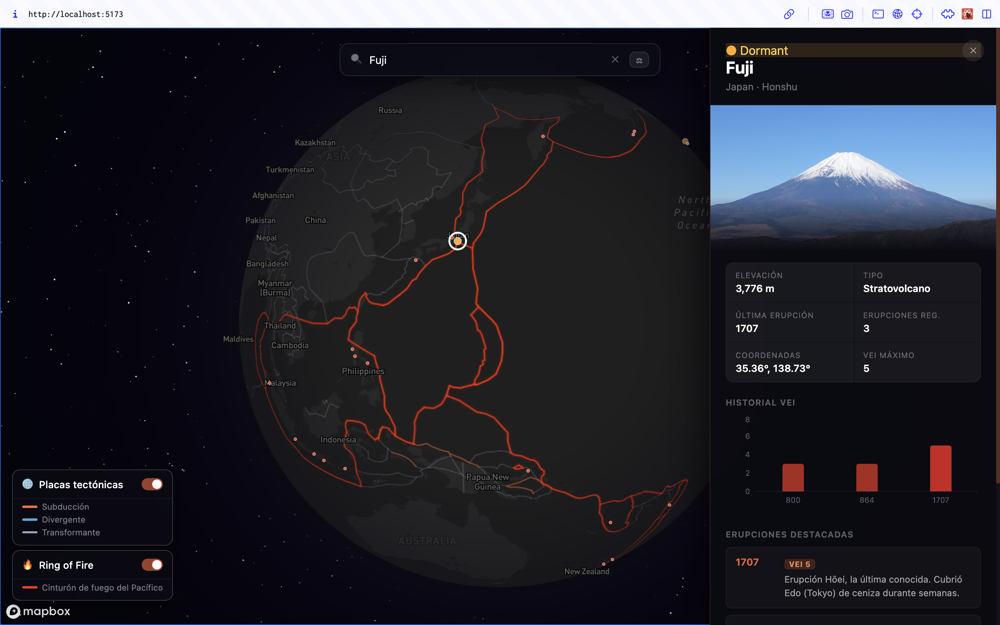
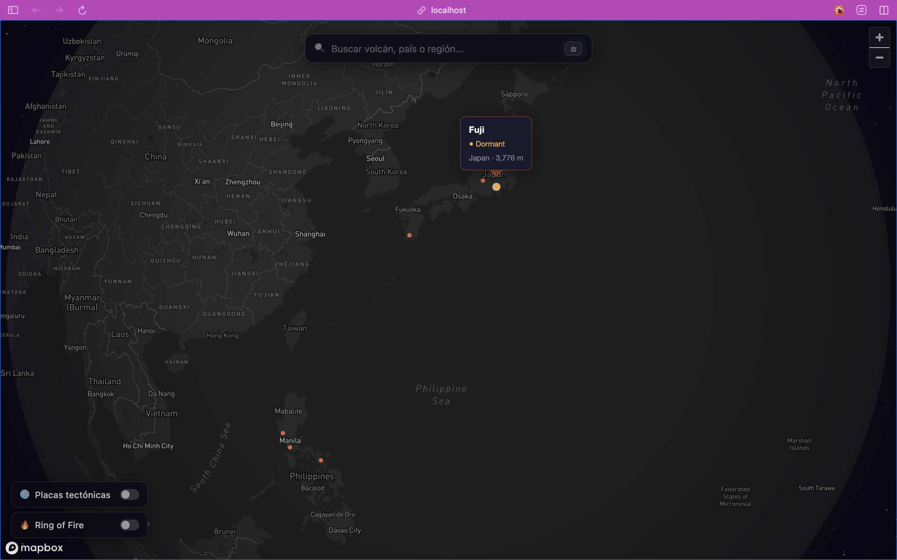
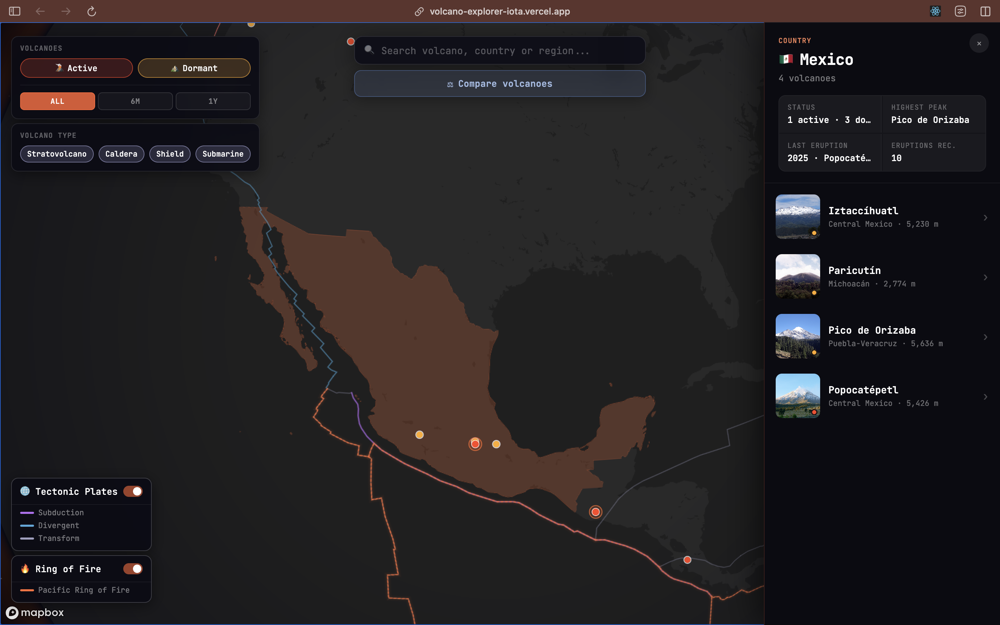
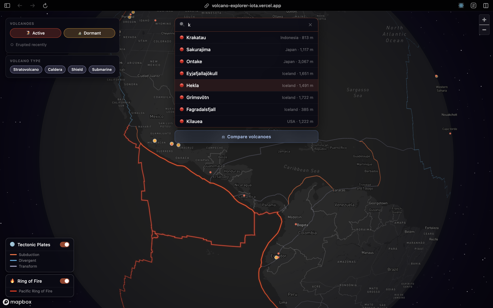
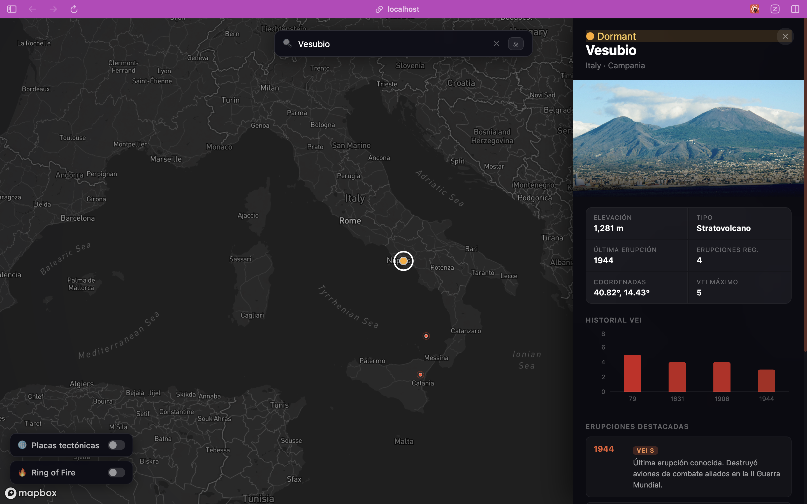
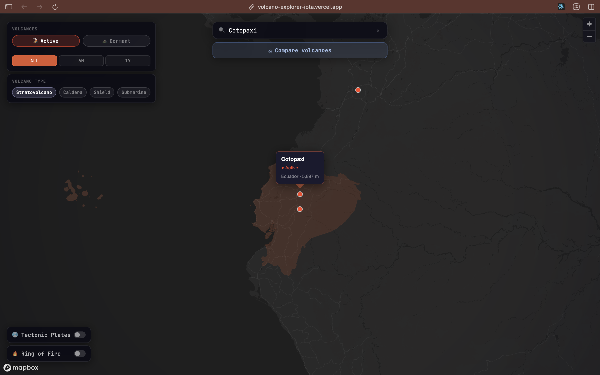
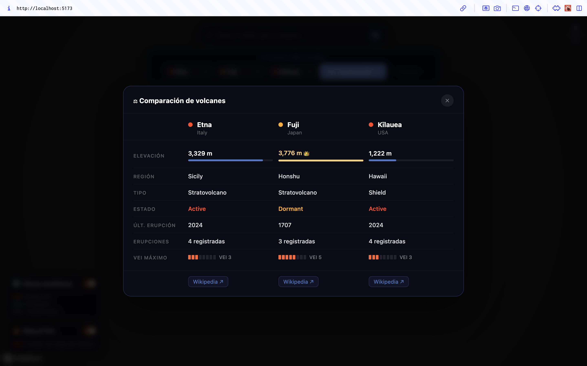

# 🌋 Volcano Explorer

An interactive 3D globe for exploring the world's volcanoes — search, filter, inspect, and compare volcanoes with eruption history, geological overlays, real-time news, and side-by-side comparisons.




---

## Features

### 🌍 Interactive 3D Globe

A fully rotatable globe built with Mapbox GL JS, inspired by [seismic.center](https://seismic.center/)'s monospace, data-dense aesthetic. The globe drifts on its own ambient rotation, pausing while you interact and picking back up automatically once you let go. Volcanoes active within the last year pulse with an animated red dot; other active and dormant volcanoes appear as solid colored circles. A warm amber atmosphere, subtle star field, and monospace UI (JetBrains Mono) give the map a cinematic, terminal-like feel — with political borders hidden so the Ring of Fire and plate boundaries read as the map's real geography.



---

### 🗺️ Country Explorer

Hover any country with a volcano to highlight it on the globe; click to open a country panel with a flag, quick stats (active vs. dormant count, highest peak, most recent eruption, total recorded eruptions), and a photo card for every volcano in that country. The highlight stays active while the panel is open, and clears automatically when you select a different country or volcano.



---

### 🔍 Search

Find any volcano by name, country, or region. Results update as you type with status indicators and elevation data.



---

### 📋 Volcano Detail Panel

Click any volcano to open a side panel with:

- Dynamic image fetched from Wikipedia
- Status badge + **"Erupted in last 12 months"** badge powered by Tavily web search
- Key stats: elevation, type, last eruption, VEI
- Full eruption history with a VEI bar chart
- **Latest news** section — real-time articles from the last 365 days via Tavily
- Links to Wikipedia, Global Volcanism Program, and Google Maps



---

### 🎛️ Map Filters

Two filter panels let you control exactly what's shown on the globe:

**Volcano filters (bottom-left)**

- Toggle **Active** and **Dormant** volcanoes independently
- **Recency filter** — segmented **All / 6M / 1Y** control to show only volcanoes with a recorded eruption in the last 6 months or year
- **Volcano Type** — filter by Stratovolcano, Caldera, Shield, or Submarine

**Geological layers (bottom-right)**

- **Tectonic Plates** — subduction zones, divergent boundaries, and transform faults in distinct colors
- **Ring of Fire** — Pacific Ring of Fire boundary overlay



---

### ⚖️ Volcano Comparison

Compare up to 3 volcanoes side by side. Click the **"Compare volcanoes"** button, add volcanoes via the searchable dropdown or by clicking on the map, then open the modal to see:

- Volcano photos fetched from Wikipedia
- Elevation bars with highest-peak crown
- VEI scores, eruption counts, status, and more



---

## Tech Stack

| Layer           | Technology                                                                                                          |
| --------------- | ------------------------------------------------------------------------------------------------------------------- |
| Framework       | [React 19](https://react.dev) + [Vite](https://vitejs.dev)                                                          |
| Map             | [Mapbox GL JS v3](https://docs.mapbox.com/mapbox-gl-js/) — globe projection, GeoJSON layers, custom animated images |
| Charts          | [Recharts](https://recharts.org) — VEI eruption history bar charts                                                  |
| Images          | [Wikipedia REST API](https://en.wikipedia.org/api/rest_v1/) — dynamic thumbnail fetching                            |
| News & search   | [Tavily API](https://tavily.com) — real-time web search for volcano news and recent activity detection              |
| Geological data | [PB2002](https://doi.org/10.1029/2001GC000252) plate boundary dataset (Peter Bird, 2002)                            |
| Styling         | Plain CSS with `backdrop-filter` glass panels, [JetBrains Mono](https://fonts.google.com/specimen/JetBrains+Mono) throughout |

---

## Getting Started

### Prerequisites

- Node.js 18+
- A free [Mapbox access token](https://account.mapbox.com/auth/signup/)
- A [Tavily API key](https://tavily.com) (for real-time news — optional)

### Installation

```bash
git clone https://github.com/your-username/volcano-explorer.git
cd volcano-explorer
npm install
```

### Configuration

Create a `.env.local` file in the project root:

```env
VITE_MAPBOX_TOKEN=pk.eyJ1Ijoi...your_token_here
VITE_TAVILY_KEY=tvly-...your_key_here
```

**No `.env.local`?** On first launch the app will prompt for your Mapbox token and save it to `localStorage`. Tavily features will be disabled without the key.

### Run

```bash
npm run dev
```

Open [http://localhost:5173](http://localhost:5173).

---

## Project Structure

```
volcano-explorer/
├── public/
│   └── data/
│       ├── volcanoes.json          # 65 volcanoes with eruption history
│       ├── plate_boundaries.json   # PB2002 tectonic boundaries
│       └── ring_of_fire.json       # Pacific Ring of Fire boundary
└── src/
    ├── components/
    │   ├── Map.jsx                 # Mapbox GL globe — all layers, filters & interactions
    │   ├── SearchBar.jsx           # Search input + Compare volcanoes button
    │   ├── VolcanoPanel.jsx        # Detail panel: stats, image, news, eruption chart
    │   ├── CountryPanel.jsx        # Country panel: flag, stats, per-volcano photo cards
    │   ├── EruptionChart.jsx       # Recharts VEI bar chart
    │   ├── LayerControls.jsx       # Volcano filters (left) + geological layers (right)
    │   ├── CompareBar.jsx          # Compare mode bar with searchable volcano dropdowns
    │   ├── CompareModal.jsx        # Side-by-side comparison modal with photos
    │   ├── WelcomeModal.jsx        # First-run onboarding steps
    │   └── TokenGate.jsx           # First-run Mapbox token prompt
    └── App.jsx
```

---

## Data

`volcanoes.json` covers **65 significant volcanoes** worldwide — 44 active and 21 dormant — spanning every major volcanic region. Each entry includes coordinates, elevation, type, activity status, eruption history (year + VEI + description), and Wikipedia/GVP links. Geological boundary data is derived from the [PB2002 dataset](https://doi.org/10.1029/2001GC000252) by Peter Bird.

---

## License

MIT
