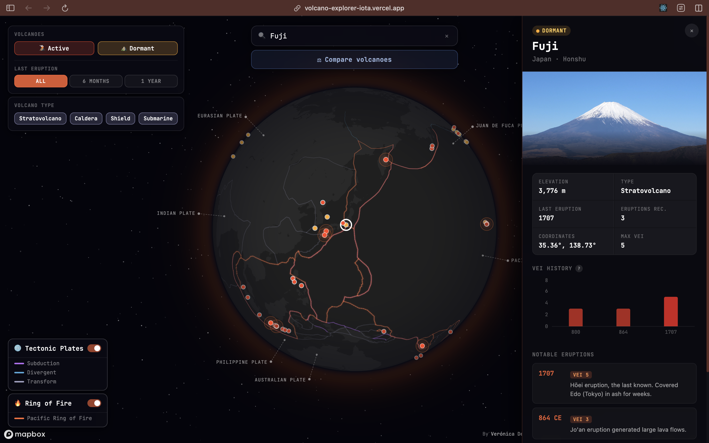
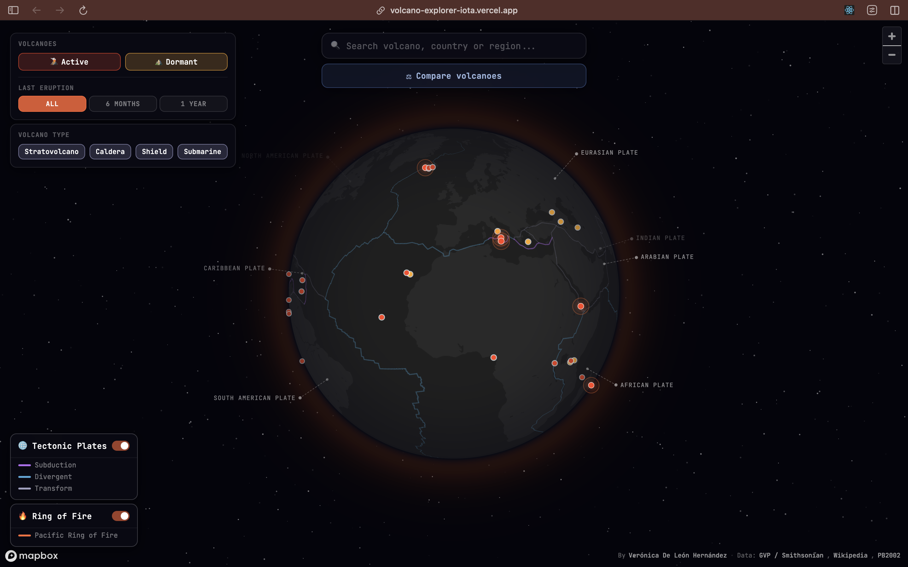
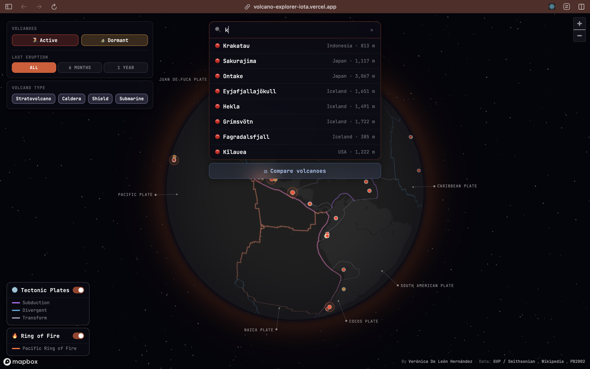
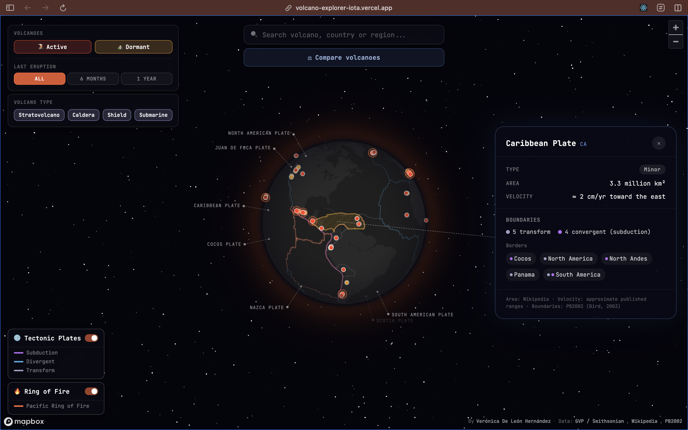
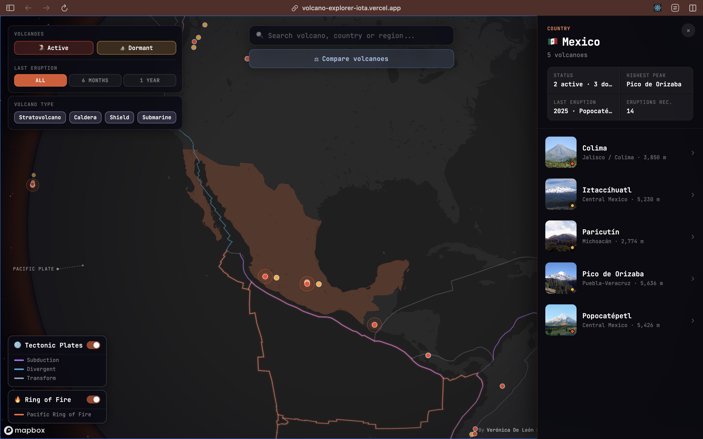
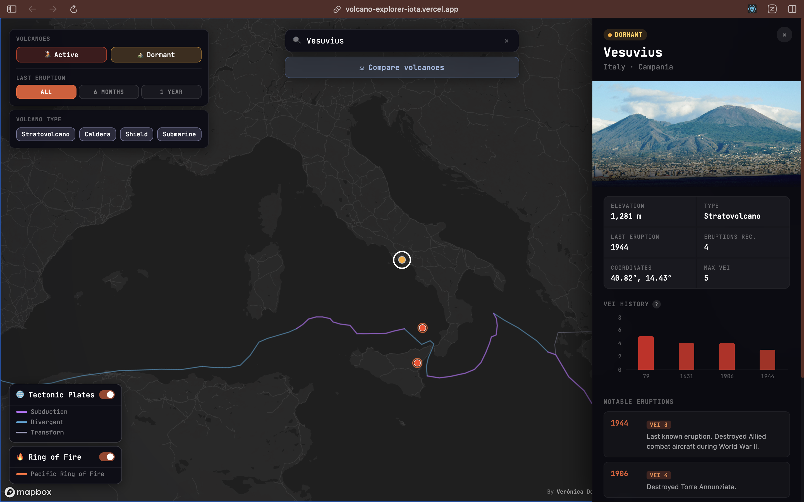
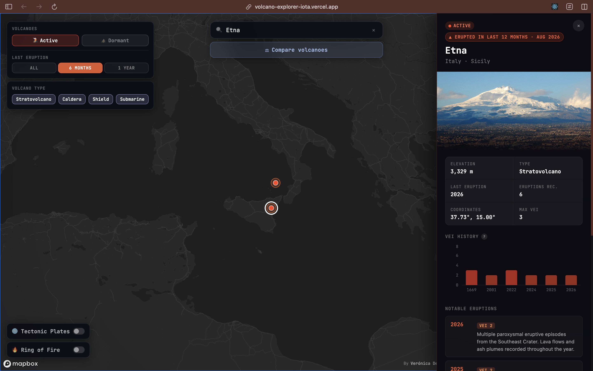
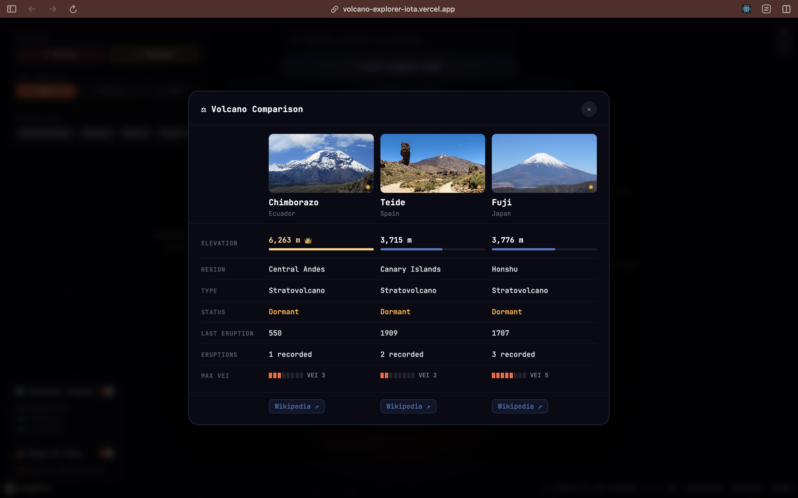

# 🌋 Volcano Explorer

An interactive 3D globe for exploring the world's volcanoes — search, filter, compare, and dive into eruption history with real-time geological overlays.




---

## What it does

**Globe** — A rotatable 3D globe built with Mapbox GL JS. Volcanoes active within the last year pulse with an animated dot; dormant ones appear as solid circles. The globe drifts on ambient rotation and pauses while you interact. Political borders are hidden so tectonic boundaries and the Ring of Fire read as the map's real geography.



**Search** — Look up any volcano by name, country, or region; pick a result to fly the globe straight to it and open its detail panel. In Compare mode, picking a result adds it to your comparison list instead.



**Tectonic plates** — Toggle subduction, divergent, and transform boundaries. When active, annotated callout lines float outside the globe labeling all 15 major tectonic plates. Click a label to open a detail panel for that plate.



**Country explorer** — Hover any country to highlight it; click to open a panel with stats, a flag, and photo cards for every volcano in that country.



**Volcano detail** — Click any volcano for elevation, type, eruption history, a VEI bar chart, a Wikipedia photo, and a real-time news feed via Tavily.



**Filters** — Toggle Active / Dormant, filter by last eruption window (All / 6 months / 1 year), and narrow by volcano type (Stratovolcano, Caldera, Shield, Submarine).



**Compare** — Add up to 3 volcanoes side by side to compare elevation, VEI, status, and eruption count.



---

## What's new in v3

- **Tectonic plate panels** — click any plate label to open a detail panel (type, area, velocity, crust, boundary composition, neighboring plates, notable features). The globe pulls back and recenters on the plate, which is highlighted with an amber fill, hatch pattern, and outline.
- **Richer tooltips** — Wikipedia thumbnails on volcano hover, volcano counts on country hover, and a VEI history tooltip with a short explainer of the scale.
- **More data** — 5 new Indonesian volcanoes (78 total), eruption dates updated through 2026, all descriptions in English.
- **Smarter filters** — Last Eruption (6 months / 1 year) applies to Active volcanoes only and disables itself when Active is off; unified control styling.
- **Fixes** — Exit compare mode, a stray line across the Pacific Plate, and dormant volcanoes vanishing under recency filters.

**Earlier versions** — **v1** (May 2026): globe, tectonic boundaries, volcano comparison. **v2** (Aug–Sep 2026): Seismic-inspired redesign, country explorer, news feed, filters, mobile support.

---

## Tech stack

| | |
|---|---|
| Framework | React 19 + Vite |
| Map | Mapbox GL JS v3 — globe projection, GeoJSON layers, custom animated markers |
| Charts | Recharts — VEI eruption history |
| Images | Wikipedia REST API |
| News | Tavily API — real-time eruption detection and latest articles |
| Geological data | [PB2002](https://doi.org/10.1029/2001GC000252) plate boundary dataset (Peter Bird, 2002) |
| Font | JetBrains Mono throughout |

---

## Getting started

```bash
git clone https://github.com/your-username/volcano-explorer.git
cd volcano-explorer
npm install
```

Create `.env.local`:

```env
VITE_MAPBOX_TOKEN=pk.eyJ1Ijoi...
VITE_TAVILY_KEY=tvly-...
```

> No token? The app will prompt for your Mapbox token on first launch and save it to localStorage. Tavily features are optional.

```bash
npm run dev
```

---

## Data

73 volcanoes across every major volcanic region — active and dormant — each with coordinates, elevation, type, eruption history (year + VEI + description), and links to Wikipedia and the Global Volcanism Program. Geological boundaries from the PB2002 dataset by Peter Bird.
